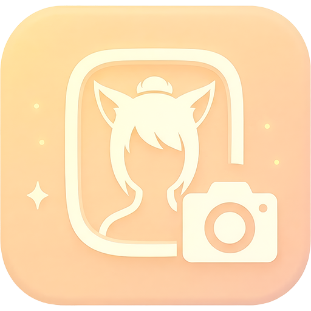
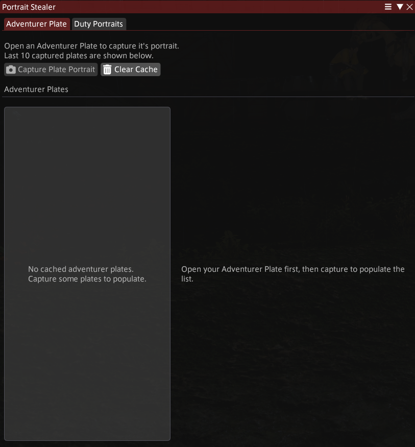
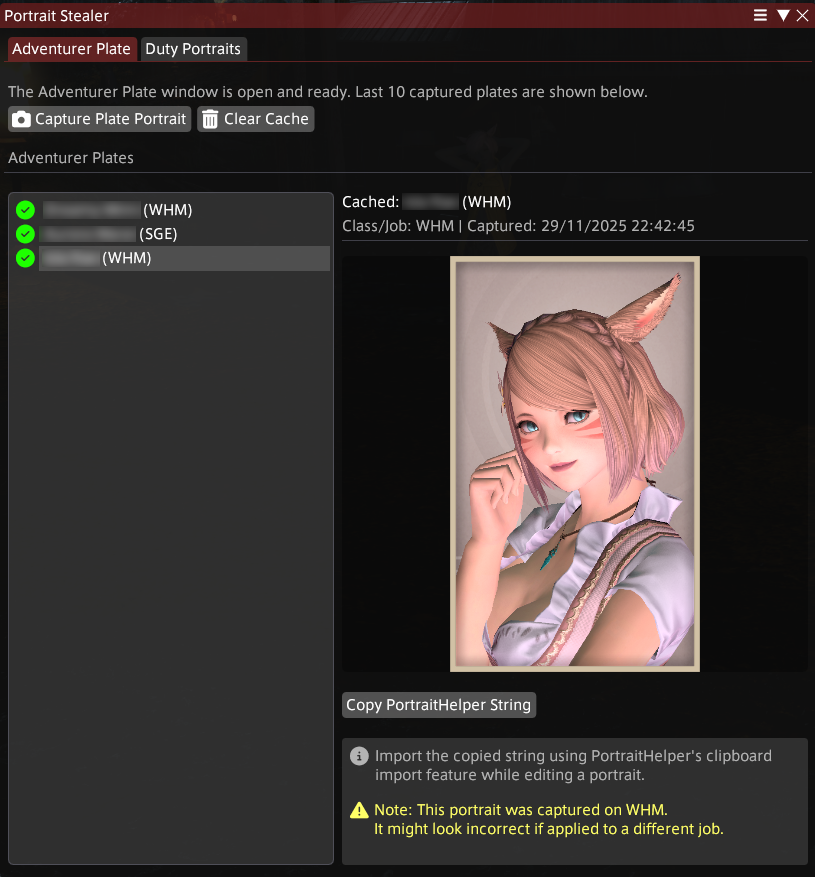

<div align="center">
  
  <h1>Portrait Stealer</h1>
  <p>Export other players' duty or adventurer plate portraits to <a href="https://github.com/Haselnussbomber/HaselTweaks/">HaselTweaks</a> strings.</p>
  <p>Inspired by <a href="https://github.com/Errerer/DalamudPlugins">CharaCardThief by Errerer</a></p>

  <!-- Badges -->
  <a href="https://github.com/BeSlightly/PortraitStealer2/releases"></a>
  <a href="https://raw.githubusercontent.com/BeSlightly/PortraitStealer2/refs/heads/main/repo.json"></a>
</div>

---

## 📖 What is it?

Portrait Stealer allows you to "steal" the portrait data from other players' Adventurer Plates or Duty Portraits. It exports this data into a format compatible with [**HaselTweaks**](https://github.com/Haselnussbomber/HaselTweaks/) (specifically the PortraitHelper module), allowing you to replicate or modify their portrait settings easily.


---

## 📥 Installation

Add this custom repo to Dalamud:

```
https://raw.githubusercontent.com/BeSlightly/PortraitStealer2/refs/heads/main/repo.json
```

---

## 🚀 How to Use

1.  **Open an Adventurer Plate**: View the Adventurer Plate of the player you want to steal from.
2.  **Open the Plugin**: Type `/psteal` to open the main window.
3.  **Capture**: Click the **Capture Plate Portrait** button.
4.  **Copy**: Click the **Copy PortraitHelper string** button.
5.  **Import**: Import the string into [HaselTweaks](https://github.com/Haselnussbomber/HaselTweaks/)/PortraitHelper.

### Screenshots

<div align="center">
  
  
</div>


